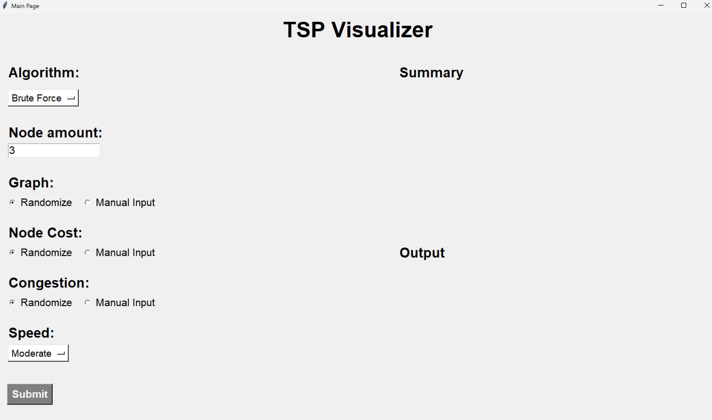
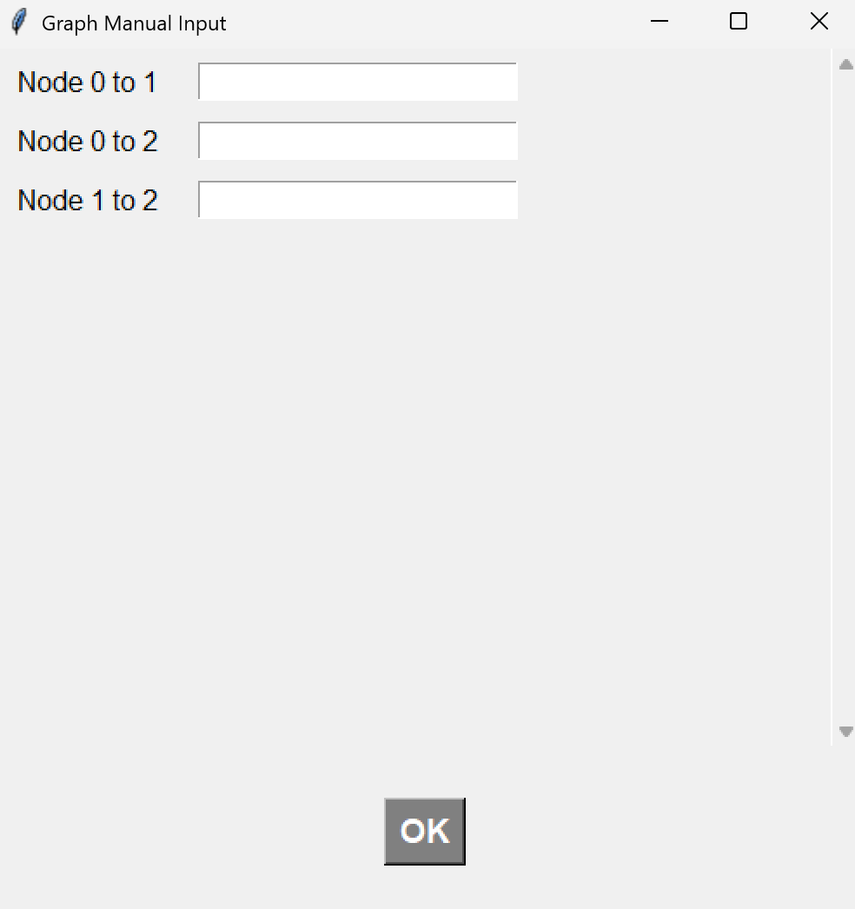
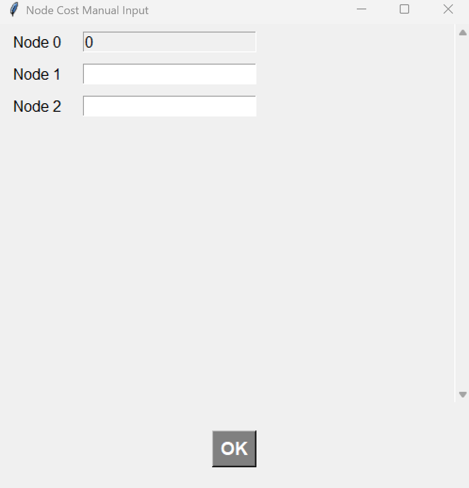
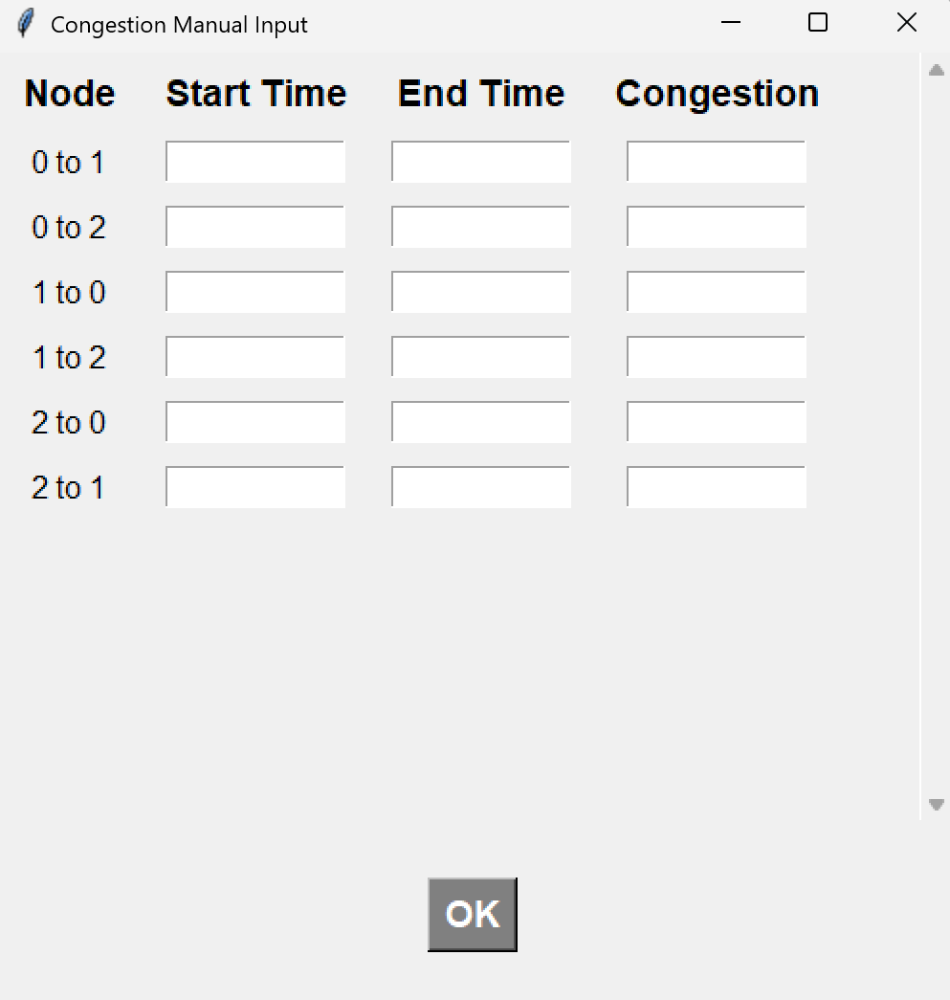
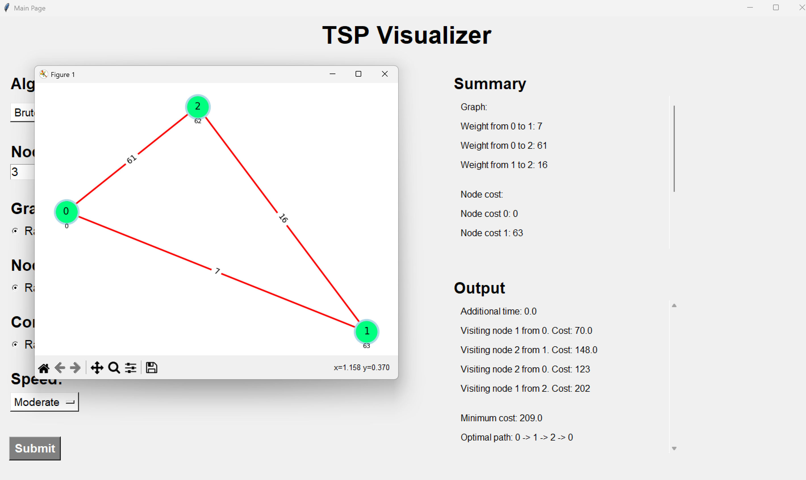

# ADA-FinalProject

**Class:** L3AC

**Members:**
- Cassie Valleria Garcia (2702391453)
- Cindy Reginia Wang (2702334815)
- Ella Raputri (2702298154)
- Ellis Raputri (2702298116)

**All Documentations:** [Click here](https://github.com/ellisraputri/ADA-FinalProject/tree/main/Documentation)

**Benchmark Process (Time):** [Click here](https://github.com/ellisraputri/ADA-FinalProject/tree/main/Time)

**Benchmark Process (Space):** [Click here](https://github.com/ellisraputri/ADA-FinalProject/tree/main/Space)

 

## Project Description
In this project, we aim to provide a solution to time-dependent travel salesman problem (TD-TSP). In the classical TSP, the time window is constant, which can lead to an inaccurate calculation. In TD-TSP, the time windows aren’t constant and will vary throughout the day. We aim to analyse the effect of travel times on the TSP problem and we hope to provide a more realistic solution to the TSP problem that reflects on real-world traffic conditions.

 

## Files
- 'Documenation' folder: all documentations (project report)
- 'GUI' folder: GUI of the project
- 'Original_Version': the classical TSP brute force implementation
- 'Space' folder: the benchmarking for space complexity
- 'Statistics' folder: the statistic calculation of the benchmarking result
- 'Time' folder: the benchmarking for time complexity
- 'backtracking.py': brute force method for our TD-TSP problem
- 'dp.py': dynamic programming approach for our TD-TSP problem
- 'tdbnb.py': branch-and-bound approach for our TD-TSP problem

 

## GUI Screenshots

&ensp;<b>Home Page</b>

- Contains all fields that need to be filled in to run the visualizer.

   

 

&ensp;<b>Manual Input</b>

- If you choose manual input for the graph, node cost, or congestion, it will show the images below.

- Manual input for graph

   

- Manual input for node cost

   

- Manual input for congestion

   

 

&ensp;<b>Result</b>

- After all of the parameters are filled, the visualizer will work by performing the algorithm step-by-step.

- The summary in the right summarizes all the graph weight, node cost, and congestion that is generated randomly or based on the user input.

- The output in the right summarizes what the visualizer is doing right now. Lastly, it will also display the minimum cost and optimal path.

   

 

 

